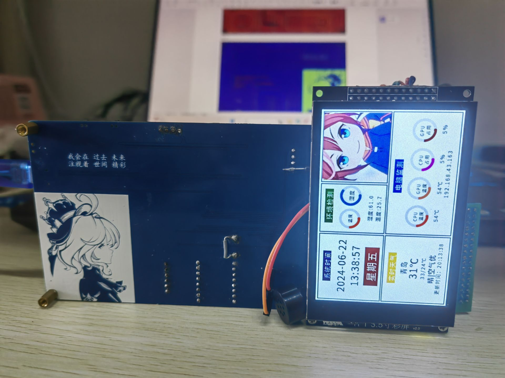
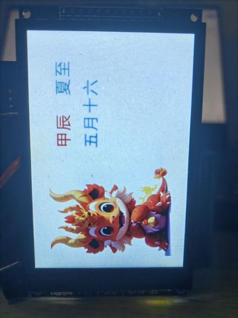
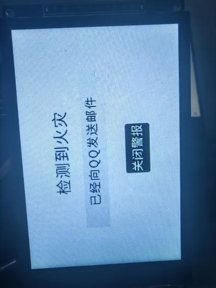
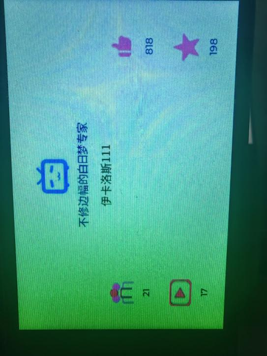
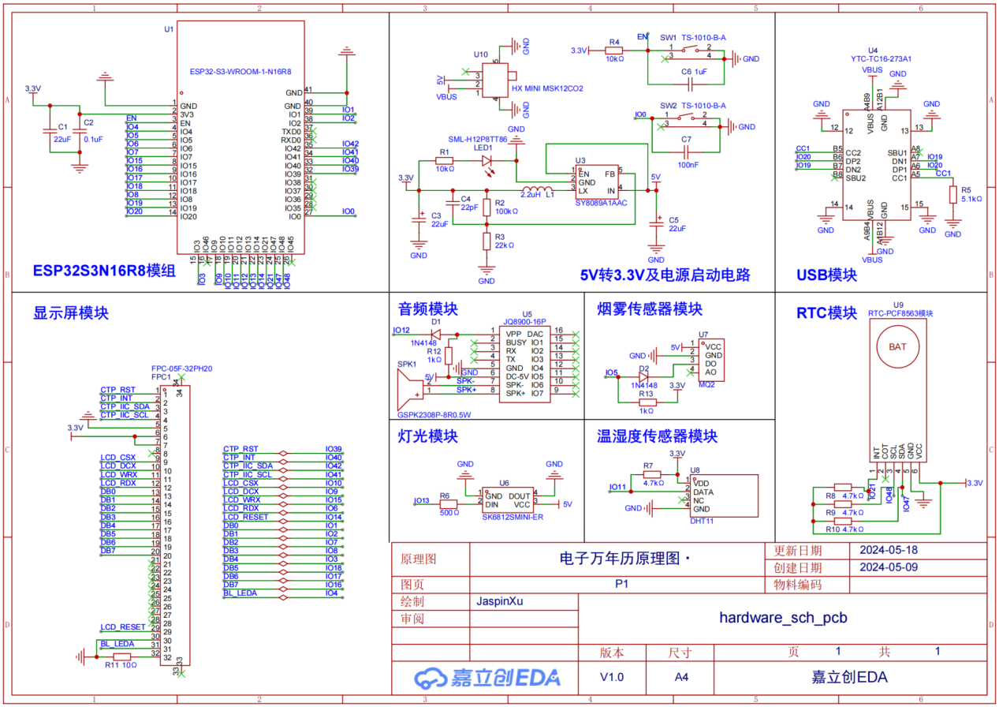
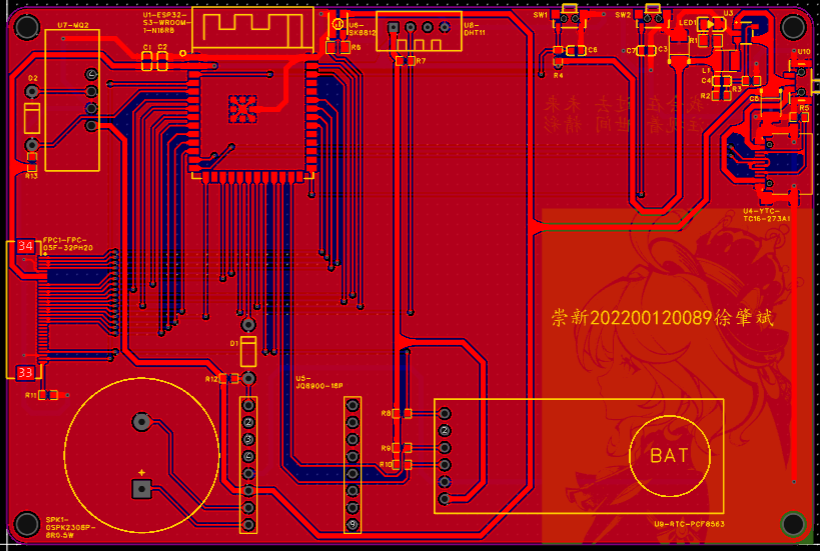
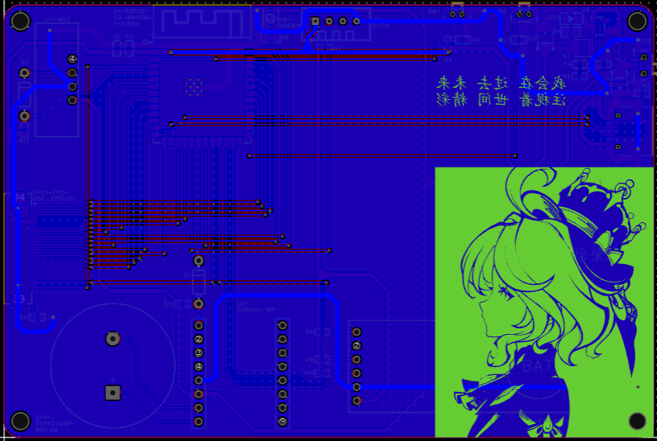
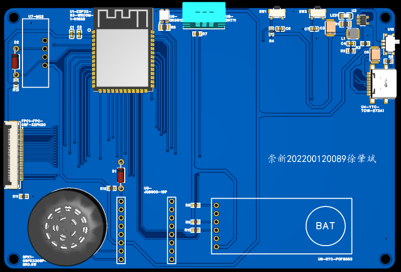
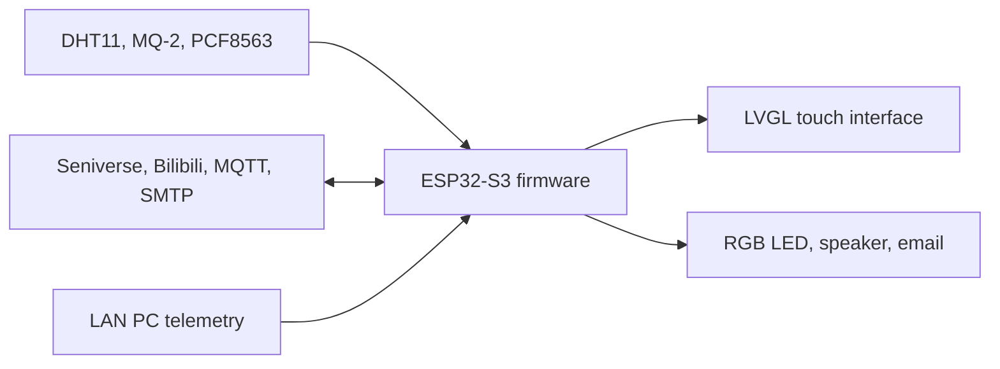

# ESP32-S3 Smart E-Calendar

An ESP32-S3 touchscreen calendar that combines timekeeping, Chinese lunar-calendar information, weather, indoor sensing, alarms, PC telemetry, and network-connected controls in one LVGL interface.


<p align="center">
  
</p>

This repository preserves the firmware and hardware documentation from a 2024 university course project. The prototype uses a custom ESP32-S3 carrier board and a 3.5-inch capacitive touchscreen. It is published as a project archive and reference implementation rather than a drop-in product.

## Highlights

- Date, time, weekday, AM/PM mode, and configurable alarm
- Chinese lunar date, zodiac, and 24 solar terms
- Current weather and daily high/low data from Seniverse
- Indoor temperature and humidity from a DHT11 sensor
- CPU/GPU temperature and usage display from a LAN telemetry endpoint
- Bilibili profile and engagement statistics
- MQ-2 smoke detection with SK6812 visual alert, audio playback, and SMTP email notification
- MQTT-based remote setting of time, weather, alarm, AM/PM mode, and music
- Touch navigation across modular LVGL screens

## Interface gallery

| Lunar calendar | Fire alert | Bilibili statistics |
|:---:|:---:|:---:|
|  |  |  |

## Hardware

| Part | Prototype configuration |
|---|---|
| MCU | ESP32-S3-WROOM-1-N16R8, 16 MB flash and 8 MB octal PSRAM |
| Display | 3.5-inch 320 x 480 TFT, ST7796 controller, 8-bit parallel interface |
| Touch | GT911 capacitive touch controller |
| RTC | PCF8563 module with backup cell |
| Sensors | DHT11 temperature/humidity and MQ-2 smoke sensor |
| Audio | JQ8900 module and 8-ohm speaker |
| Indicator | SK6812 addressable RGB LED |
| Power | USB-C input and SY8089A 5 V to 3.3 V regulator stage |

The original [schematic](hardware/schematic.png) and [prototype BOM](hardware/prototype-bom.xlsx) were recovered from the course materials. The assembled prototype changed the screen and audio wiring late in development, so treat both files as design records rather than guaranteed as-built documentation.

## Hardware design files

The available hardware material consists of exported design views rather than the original editable EDA project:

- [Full-resolution schematic](hardware/schematic.png)
- [Prototype BOM](hardware/prototype-bom.xlsx)
- [PCB top-layer view](hardware/pcb-top-layer.png)
- [PCB bottom-layer view](hardware/pcb-bottom-layer.png)
- [PCB 3D preview](hardware/pcb-3d-preview.png)

### Schematic

<p align="center">
  <a href="hardware/schematic.png">
    
  </a>
</p>

### PCB layout

| Top layer | Bottom layer |
|:---:|:---:|
| <a href="hardware/pcb-top-layer.png"></a> | <a href="hardware/pcb-bottom-layer.png"></a> |

### PCB 3D preview

<p align="center">
  <a href="hardware/pcb-3d-preview.png">
    
  </a>
</p>

### GPIO map

| Peripheral | ESP32-S3 pins |
|---|---|
| TFT control | CS 10, DC 9, RST 14, WR 15, RD 6, BL 4 |
| TFT data bus | D0-D7: 1, 2, 7, 8, 3, 18, 17, 16 |
| GT911 touch | SDA 42, SCL 41, INT 40, RST 39 |
| PCF8563 RTC | SDA 47, SCL 48 |
| DHT11 | 11 |
| MQ-2 digital output | 5 |
| JQ8900 one-wire control | 12 |
| SK6812 data | 13 |

## Software overview



The application is organized as individual screens under `src/app`. LVGL handles the UI, TFT_eSPI drives the parallel display, TAMC_GT911 reads touch input, and PlatformIO manages the Arduino build and external dependencies.

## Build and flash

### Requirements

- VS Code with the PlatformIO extension, or PlatformIO Core
- An ESP32-S3 board compatible with the pin map above
- A 16 MB flash / 8 MB PSRAM configuration matching the prototype
- Credentials for any network features you intend to use

### 1. Clone the project

```bash
git clone https://github.com/JaspinXu/esp32-based-e-calendar.git
cd esp32-based-e-calendar
```

### 2. Review the prototype configuration

Before building, review the hardware pin assignments and network settings in the source tree. The archived prototype keeps its original Wi-Fi, Seniverse, Bemfa MQTT, SMTP, PC telemetry, and Bilibili values in the relevant application modules. Replace them locally before connecting the device to your own services.

### 3. Build, upload, and monitor

```bash
pio run
pio run --target upload
pio device monitor
```

If PlatformIO cannot discover the board automatically, pass the upload port on the command line or configure it locally. The checked-in environment uses `esp32-s3-devkitc-1`, QIO flash at 80 MHz, OPI PSRAM, a 921600 baud upload speed, and `partitions-no-ota.csv`.

## Repository layout

```text
include/                     Shared declarations
src/main.cpp                 Firmware entry point
src/gui.cpp                  LVGL application shell and screen navigation
src/app/home/                Clock, weather, sensors, and PC telemetry
src/app/lunar/               Lunar calendar, solar terms, and zodiac assets
src/app/bilibili/            Bilibili statistics screen
src/app/music/               Alarm and JQ8900 audio control
src/app/fire/                Smoke alarm, RGB indicator, and email alert
src/app/ota/                 MQTT remote-control screen
src/driver/                  Display, touch, and filesystem ports
lib/                         Bundled LVGL, TFT_eSPI, and GT911 sources
hardware/                    Schematic, PCB exports, and prototype BOM
docs/images/                 Prototype and interface photographs
platformio.ini               Board, memory, dependency, and upload settings
```

## Prototype limitations

- The final assembly uses adapter boards and jumper wiring that differ from the first PCB revision.
- Weather requests use the prototype's original HTTP implementation. Do not send sensitive data through that connection.
- The PC telemetry parser expects an AIDA64-style `/sse` response on the local network and may require code changes for a different exporter.
- The partition file is named `partitions-no-ota.csv`; verify the flash layout before extending the OTA code.
- The archived UI and third-party libraries are relatively large, and the project has not been generalized for other display modules.

## Security note

The archived source contains prototype credentials and service identifiers. Treat every exposed value as compromised, rotate any credential that is still active, and move private values into a Git-ignored local configuration before reconnecting or republishing the firmware. Rewriting the current files alone would not remove values from Git history.

## Background

The project began as an electronic music perpetual-calendar assignment. Its final prototype grew to include network weather data, environmental sensing, smoke alerts, PC monitoring, Bilibili statistics, and MQTT control. The report, class slides, module datasheets, test binaries, and third-party example projects remain outside this repository because they contain personal course information, redundant vendor material, or unclear redistribution rights.
